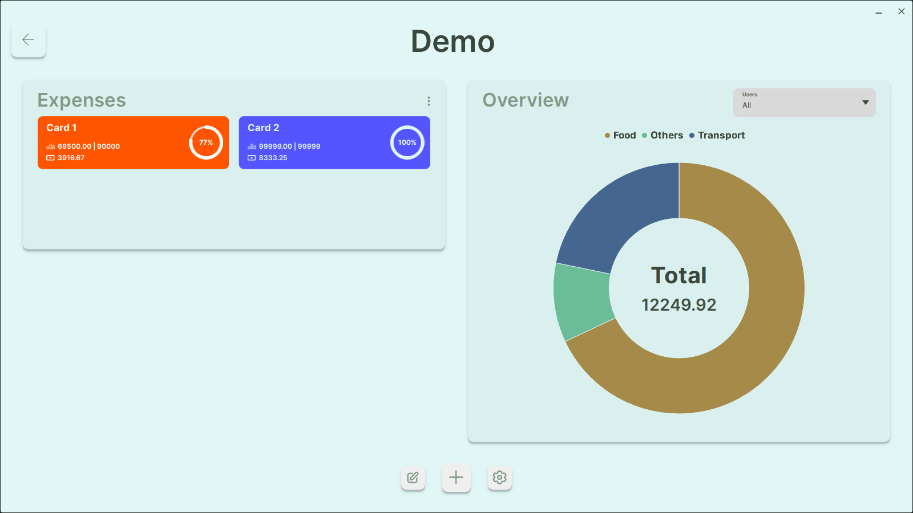

# Financy

Long where the days that I used a spreadsheet to take care of my finances, I created this to make it easily manegeable and more rewarding

## Requirements

These are required to run the applications as a developer.

### Windows
- 1 Install [Visual Studio 2019](https://visualstudio.microsoft.com/vs/older-downloads);
- 2 Install [CMake](https://cmake.org/download) (Version 3.11.0);
- 3 Install [QtCore, QtQuick, QtGui, QtQml, QtChart](https://www.qt.io/download-dev) (Version 6.7.0);

## Getting up and running

Follow these steps to run it locally.

### Windows
- 1 Go to the `Script/Vendors` folder;
- 2 Run the command `./OpenCV.bat "Visual Studio 16 2019" "Debug"`;
- 3 Go the root of the repo;
- 4 Create a file named `.env.cmake` and add your **Qt** installation location as `QT_PATH` variable `set(QT_PATH "{QT_PATH}")`;
- 5 Run the command `cmake . -B "./build" -G "Visual Studio 16 2019" -DCMAKE_BUILD_TYPE="Debug"`;
- 6 Go to the `Bin/Debug` and open the `Financy.exe`.

## Deploying

These are the steps to generate the installer ready for production.

### Windows
- 1 Install [Wixtoolset](https://github.com/wixtoolset/wix/releases) (Version 5.0.0);
- 2 Install [CQtDeployer ](https://github.com/QuasarApp/CQtDeployer/releases) (Version v1.6.2360);
- 3 Go to the `Script/Deploy` folder;
- 4 Run the command `./Pack.bat`;
- 5 Go back to the root of the repo;
- 6 The installer should be located inside the `Deploy` folder.
